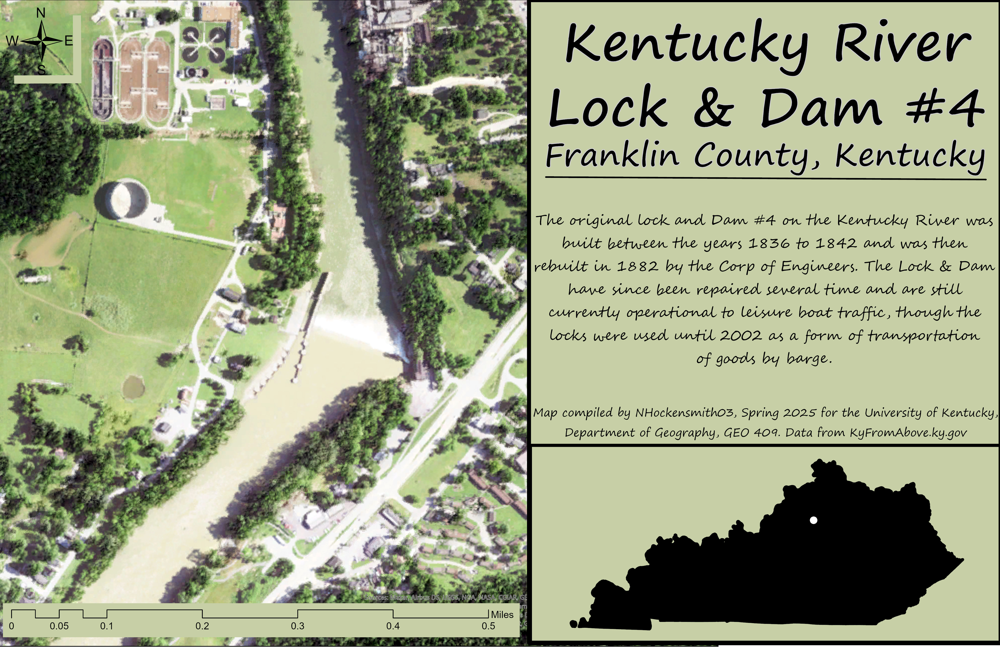
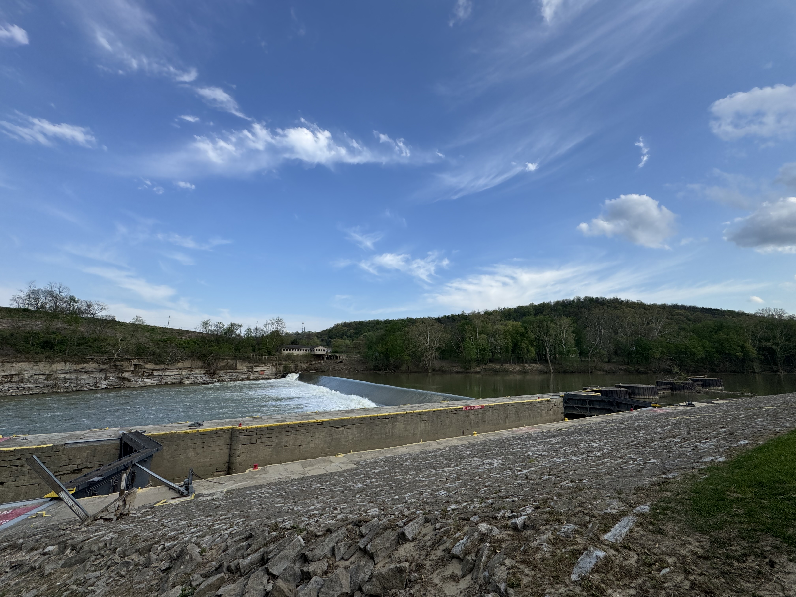
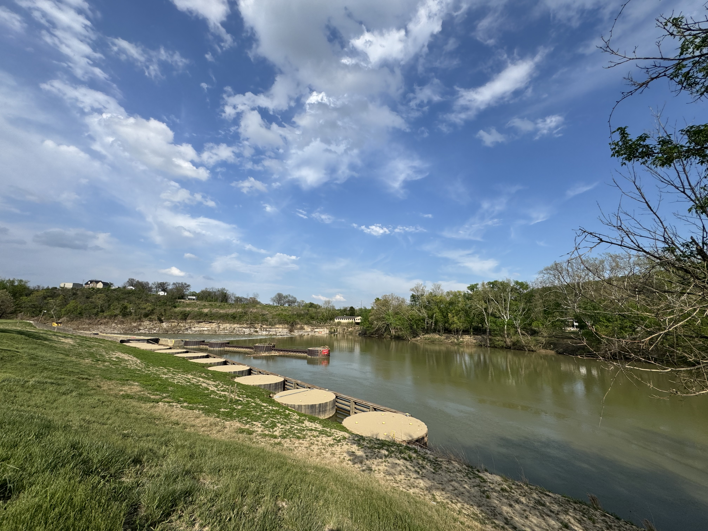

# Kentucky River Lock & Dam #4
## Franklin County, Kentucky

The original lock and Dam #4 on the Kentucky River was built between the years 1836 to 1842 and was then
rebuilt in 1882 by the Corp of Engineers. The Lock & Dam have since been repaired several time and are still currently operational to leisure boat traffic, though the locks were used until 2002 as a form of transportation of goods by barge.

     
*Kentucky River Lock & Dam #4* 

[Link to high-resolution version](KyRivShadeRelief.pdf)     

Map compiled by NHockensmith03, Spring 2025 for the University of Kentucky, Department of Geography, GEO 409. Data from KyFromAbove.ky.gov. The data was compiled using ArcGIS Pro and Blender
# Photos of the Area 
     
*Picture of sign near Kentucky River Lock & Dam #4 by Nick H* 

     
*Picture of Kentucky River Lock & Dam #4 from the west side of the dam facing south east by Nick H* 

     
*Picture of Kentucky River Lock & Dam #4 from the east side of the dam facing north west by Nick H*

     
*Picture of Kentucky River Lock & Dam #4 from the west side of the river facing north east by Nick H*